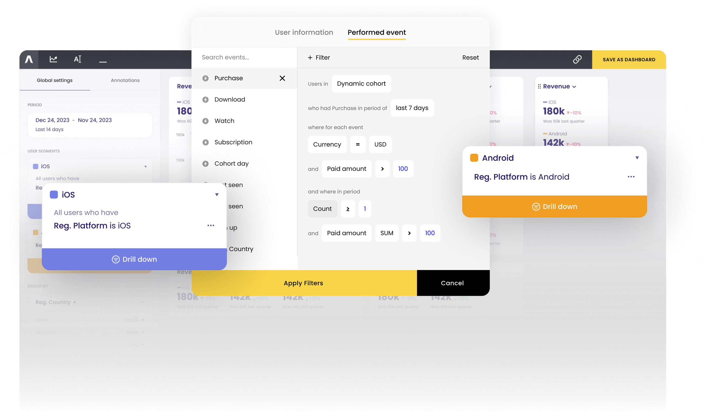

# Introduction to Asemic

Simple business questions often requre complex interaction with data, with our tool we aim to make simple questions easy
to answer and open-up space to ask even more interesting questions.

Asemic is a next-generation data warehouse-natice product analytics platform designed to simplify how you interact with
the data and automating data modelling tasks. The core to this is our powerful Semantic Layer.

## Core Concepts

### Data Integration

Asemic is designed to work with your existing data warehouse, minimizing the need for complex ETL processes. Our system
can automatically generate and maintain your data model based on the definitions of the metrics and entities in the
Semantic Layer.

### Semantic Layer

At the heart of Asemic is our innovative three-layer Semantic Layer:

1. **User Action Definition Layer**: Defines available User Actions, providing context to raw event data. At minimum,
   these are your User Events, but you can simply extend it with custom tables.
2. **User Properties Layer**: Aggregates actions on a per-user, per-day basis, serving as building blocks for KPIs.
   Tracks state of the user through time, allowing easy time-travel and simplifies advanced analysis.
3. **KPI Layer**: Constructs complex KPIs with awareness of different dimensions and aggregation methods.

This approach allows for unprecedented flexibility in defining and analyzing user behavior.

[TODO: Add an image here illustrating the three layers of the Semantic Layer]

### Time Travel

Like in all standard BI tools, you can generate user segments in real-time based on user properties.

You can even ad-hoc use User Actions to segment data providing additional layer of flexibility.

Unique to Asemic, it enables asking questions involving time-dependant states, or in other words, segment users by their
past (or *future) state, thanks to its model that tracks the state of each User through time. Answer questions like:

- What is the revenue of users who have been low spenders in January (property from past) and have seen promotion on
  February 1st (had Action in past)? What's it like compared to the baseline of the January low spenders who haven't had
  the promotion in February?
- How much time users who will buy something / do something in one week from now spend in our app, compared
  to [some baseline definition]

> *future compared to time being observed.

### Auto-maintanence of the Physical Model

Semantic Layer is not an afterthought, it is the core concept that preceeds physical data model. Asemic uses logical
structure in the Semantic Layer to generate data model from the events and then automatically builds and maintains this
structure.

> Define your business first, don't think about Data Modeling

### Advanced Funnel Analysis

Asemic provides simple pattern-matching language for dealing with sequences. Asemic's funnel analysis goes beyond simple
linear funnels:

- Support for optional steps
- Time-dependant Funnels
- Parallel paths
- Negative conditions (NOT steps)
- Flexible time horizons and delays between steps
- Setting custom Domain for funnel analysis

This allows you to model complex user journeys and gain insights into nuanced behavior patterns.

### Long-term User Journey

Funnels can provide insights in the early days of User Journey and model short-term decision making processes.

Long-term User Journey is best modeled using multiple cohort metrics that track various states over many days. Asemic
provides simple interface for defining cohort metrics and has specialized UI for working with it.

## What Sets Asemic Apart

- **Business-First**: Define metrics and KPIs using a business-logic first approach, without being constrained by your
  physical data model.
- **Not-only-visualization tool**: Asemic is not visualizatin tool for your data, it's doing data modelling so you don't
  have to, unless you want to.
- **Power**: Perform complex analyses that would be difficult or impossible with traditional tools. Internal data model
  provides capabilities beyond what is possible with other tools, even when they are using the same model.
- **Scalability**: Asemic is built to handle large volumes of data efficiently, with optimizations at both the data
  model and query level.

## Prerequisites

1. **SQL Data Warehouse**: Your data must be stored in a SQL-compatible data warehouse.

2. **User Events**: You should have tables containing user events, either stored in separate tables or in one
   consolidated table.

3. **First Appearance Event**: One of your tables should have one row per user's first appearance in the system.

4. **Activity Event**: One of your tables should have at least one row per user per day when they are active.

While Asemic is flexible in terms of data structure, having a well-organized event schema will make the integration
process smoother. Consider the following:

1. **Consistent User Identifier**: Ensure you have a consistent user ID across all relevant tables.
2. **Timestamp Fields**: Each event should have an associated timestamp.
3. **Event Type Identification**: There should be a clear way to distinguish between different types of events.
4. **Event structure**: Events are stored either each in a separate table, or all events in one big table with clear
   event type identification

---
In the following sections, we'll dive deeper into each of these concepts and show you how to leverage the full power of
Asemic for your product analytics needs.

