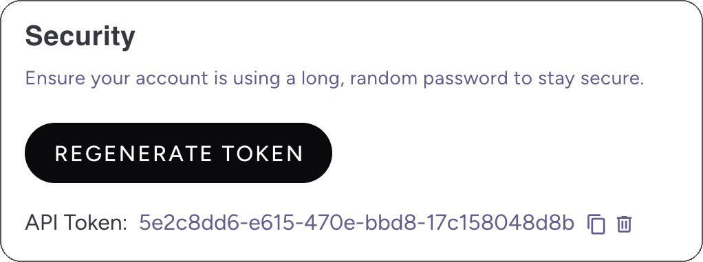

# Developer Quickstart

The Asemic comes with CLI app for setting up and maintaining your project. It is Git-friendly, low-code solution.

## Connecting to Your Data

This guide will walk you through the process of connecting your data sources to Asemic. We'll cover the steps for the
main supported data warehouses.

### Setting Up Workspace

Once you have been registered with Asemic, you will have a workspace and a starting project set up.

Workspace can contain multiple projects, and each project is an indepented entity, containing datasets of a single
product. (At the moment, workspace and project will be set for you during onboarding)

First go to `Settings -> Profile` in Asemic UI. We'll need API Token for the next step.



## Asemic CLI Installation

You'll need to install the Asemic CLI tool, which is used for managing the semantic layer. Installation instructions:

#### macOS ARM

```bash
curl -L -o asemic-cli https://github.com/Bedrock-Data-Project/asemic-cli/releases/latest/download/asemic-cli-macos-arm
chmod +x asemic-cli
sudo mv asemic-cli /usr/local/bin
```

#### macOS x64

```bash
curl -L -o asemic-cli https://github.com/Bedrock-Data-Project/asemic-cli/releases/latest/download/asemic-cli-macos-x64
chmod +x asemic-cli
sudo mv asemic-cli /usr/local/bin
```

#### Ubuntu

```bash
curl -L -o asemic-cli https://github.com/Bedrock-Data-Project/asemic-cli/releases/latest/download/asemic-cli-ubuntu
chmod +x asemic-cli
sudo mv asemic-cli /usr/local/bin
```

#### Windows

Windows is not directly supported, but the Ubuntu binary can be used with WSL (Windows Subsystem for Linux).

#### Post-installation

`chmod +x asemic-cli sudo mv asemic-cli /usr/local/bin`

## Setting Up the Asemic CLI

You'll need to set up the Asemic CLI:

1. Generate an API token from the Asemic Settings page
2. Export the token to your environment:
   ```bash
   export ASEMIC_API_TOKEN=<your_token_here>
   ```

## Setting Up Connection

### Big Query

To connect Asemic to your BigQuery database, you need to create a service account with the following roles:

- **BigQuery Data Viewer**
- **BigQuery Job User**
- **BigQuery Data Editor** (for the dedicated dataset where the data model will be created)

> For detailed instructions on creating a service account, please refer
> to [Google's support documentation](https://support.google.com/a/answer/7378726).

> TODO: ivan passing service key

Once you have your service account key, you need to base64 encode it (you can use an online utility
like https://www.base64encode.org/ for that, or doing it in terminal). Then will gcp project id and base64 encoded
service account key in create connection popup. Before submitting, make sure test connection button says it can connect
succesfully.

After connecting to database, take note of API ID found in projects list. This will be your identifier when working with
asemic-cli , the tool for managing your asemic semantic layer.

> Note: it is recommended to store your semantic layer config on version control, to facilitate collaboration. If using
> github, you can check the asemic demo example: https://github.com/Bedrock-Data-Project/bedrock-demo
> This repo uses github actions for automatic validation of pull requests, automatic push on merge to main branch and
> workflow for backfilling the entity model.

#### Not Using Big Query?

Don't worry, we support almost all data warehouses with standard SQL interface.
Check [Connecting Data Sources](../4%20advanced%20topics/1%20Connecting%20Data%20Sources.md) for more examples.

## Setting up Semantic Layer

The Asemic semantic layer is primarily built to handle User Entity data model which consumes events generated by a User
interacting with your online app. User Entity is defined by a set of **properties** (attributes describing the user) and
**KPIs** are defined as aggregations of user properties.

Before generating the semantic layer, Asemic makes the following assumptions:

1. Data is tracked in one or more event tables, where each row represents an event performed by a user at a specific
   time.
2. A "first appearance" event table exists, where each user has one row with the timestamp of their first interaction in
   the system.
3. An activity table exists, where each user has a row for every date they were active (interacting with the system in a
   meaningful way, such as logging in).
   Given these assumptions, Asemic can generate dozens of industry-standard KPIs as a starting point.

#### Generating the User Entity Model

1. **Create a Directory**: Name the directory after your API ID (retrievable from the Asemic Settings page under the
   Team tab, API ID column).
   ```bash
   mkdir {API_ID} && cd asemic-config
   ```
2. **Run the Asemic CLI**: Use the `asemic-cli user-entity-model activity-action` command to start a wizard that will
   map the activity. The process will resemble the following example:

   ```
   asemic-cli user-entity-model activity-action
   Enter full table name: gendemo.ua_login
   Getting table schema...
   Columns:
      user_id [integer]
      time [datetime]
      session_id [string]
      platform [string]
      application_version [integer]
      build_version [string]
      country [string]
      language [string]
      manufacturer [string]
      model [string]
      os_version [string]
      memory_size [string]
      screen_width [integer]
      screen_height [integer]
      screen_dpi [integer]
      device_language [integer]
      date [date]
   Enter action name [Leave empty for ua_login]: login

   Action datasources need a date column.
   Ideally, this should be a partition column for performance reasons.
   Enter date column name [Leave empty for date]: 

   A timestamp column is needed that represents the exact time action happened
   Enter timestamp column name [Leave empty for time]: 

   Enter the name of the column that represent the id of the user that performed the action
   Enter user id column name [Leave empty for user_id]: 
   Adding last_login_property tag to platform. It means entity property will be generated from it.
   Adding last_login_property tag to application_version. It means entity property will be generated from it.
   Adding last_login_property tag to build_version. It means entity property will be generated from it.
   Adding last_login_property tag to country. It means entity property will be generated from it.
   Adding last_login_property tag to os_version. It means entity property will be generated from it.
   Datasource saved to bedrock-demo/userentity/actions/login.yml
   ```

- Do the same for first appearance:

   ```
   asemic-cli user-entity-model first-appearance-action
   Enter full table name: gendemo.ua_registration
   Getting table schema...
   Columns:
      user_id [integer]
      time [datetime]
      session_id [string]
      engagement [number]
      payment_propensity [number]
      skill [number]
      platform [string]
      application_version [integer]
      build_version [string]
      country [string]
      language [string]
      manufacturer [string]
      model [string]
      os_version [string]
      memory_size [string]
      screen_width [integer]
      screen_height [integer]
      screen_dpi [integer]
      device_language [integer]
      date [date]
   Enter action name [Leave empty for ua_registration]: registration

   Action datasources need a date column.
   Ideally, this should be a partition column for performance reasons.
   Enter date column name [Leave empty for date]: 

   A timestamp column is needed that represents the exact time action happened
   Enter timestamp column name [Leave empty for time]: 

   Enter the name of the column that represent the id of the user that performed the action
   Enter user id column name [Leave empty for user_id]: 
   Adding first_appearance_property tag to platform. It means entity property will be generated from it.
   Adding first_appearance_property tag to application_version. It means entity property will be generated from it.
   Adding first_appearance_property tag to build_version. It means entity property will be generated from it.
   Adding first_appearance_property tag to country. It means entity property will be generated from it.
   Adding first_appearance_property tag to os_version. It means entity property will be generated from it.
   Datasource saved to /Users/ikorhner/projects/bedrock-demo/userentity/actions/registration.yml
   ```

3. **Handle Payment Transaction Data**: If you have an action that contains payment transaction data, use
   `asemic-cli user-entity-model payment-transaction-action`.
4. **Generate the Entity Model**: Run `asemic-cli user-entity-model entity` to generate an initial set of properties and
   KPIs.

#### Directory Structure

Once generated, the structure will contain three subfolders:

```bash
Project name (your {API_ID})
├── actions          # Actions are Asemic's way of describing user events. 
|                    # It can be any table with rows identified by user ID, timestamp, 
|                    # and optional attributes.
├── kpis             # KPIs are metrics that can be plotted on charts.
└── properties       # Think of properties as columns that you can filter or group by.
```

### Properties

Properties are a powerful mechanism to define complex columns easily. There are several types of properties, each
serving a specific purpose.

Here's a few examples.
Check [Settings Up Semantic Layer](../4%20advanced%20topics/3%20Setting%20Up%20Semantic%20Layer.md) for more detailed
instructions how to set up

```yaml
# sum of revenue field in payment_transaction_action
revenue_on_day:  
  data_type: NUMBER  
  can_filter: true  
  can_group_by: false  
  action_property: {
   source_action: payment_transaction, 
   select: '{revenue}', 
   aggregate_function: sum, 
   default_value: 0
   }

# max level played on a given day
max_level_played:  
  data_type: INTEGER  
  can_filter: true  
  can_group_by: true  
  action_property: { 
   source_action: level_played, 
   select: "{level_played.level}", 
   aggregate_function: max, 
   default_value: ~ 
   }

# Users will have value of 1 if active on a date, otherwise 0
active_on_day:  
  data_type: INTEGER  
  can_filter: false  
  can_group_by: false  
  action_property: {
   source_action: activity, 
   select: 1, 
   aggregate_function: none, 
   default_value: 0
   }

payment_segment:  
  data_type: STRING  
  can_filter: true  
  can_group_by: true  
  computed_property:  
    select: '{revenue_lifetime}'  
    value_mappings:  
    - range: {to: 0}  
      new_value: Non Payer  
    - range: {from: 0, to: 20}  
      new_value: Minnow  
    - range: {from: 20, to: 100}  
      new_value: Dolphin  
    - range: {from: 100}  
      new_value: Whale
```

### Kpis

Kpis are aggregations of properties that can get plotted over time.
Examples:

```yaml
# number of daily active users
dau:  
  label: DAU  
  select: SUM({property.active_on_day})  
  x_axis:  
    date: {total_function: avg}  
    cohort_day: {}

retention:  
  select: SAFE_DIVIDE({kpi.dau} * 100, SUM({property.cohort_size}))  
  unit: {symbol: '%', is_prefix: false}  
  x_axis:  
  # date is not available as an axis for cohort metric
    cohort_day: {}

# generated retention_d1, retention_d2, etc
retention_d{}:  
  select: SAFE_DIVIDE({kpi.dau} * 100, SUM({property.cohort_size}))  
  where: '{property.cohort_day} = {}'  
  unit: {symbol: '%', is_prefix: false}  
  x_axis:  
    date: {}  
  template: cohort_day

# reference other kpis
arpdau:  
  label: ARPDAU  
  select: SAFE_DIVIDE({kpi.revenue}, {kpi.dau})  
  unit: {symbol: $, is_prefix: true}  
  x_axis:  
    date: {}  
    cohort_day: {}
```

### Submitting semantic layer

After generating the semantic layer, it needs to be submitted to asemic. Before submitting, it is recommend to run
`asemic-cli config validate` to validate the configuration. asemic-cli will dry run several queries to test your
properties and kpis.
After validate is succesful, config should be submitted by using `asemic-cli config push`

### Backfilling the semantic layer data model

As a final step, semantic layer needs to be backfilled. This can be done either by using asemic-cli (
`asemic-cli user-entity-model backfill --date-from='2024-08-23' --date-to='2024-08-25'`) or, if using github, runnning a
backfill workflow (see [Demo Project](https://github.com/Bedrock-Data-Project/bedrock-demo) for an example).

Asemic materializes your physical data model for performance reasons and is expected to be integrated with your etl
process to backfill the data as it becomes available.

---
This will generate the basic set of properties and metrics from your events. To get the most check Advanced Topics in
the documentation.