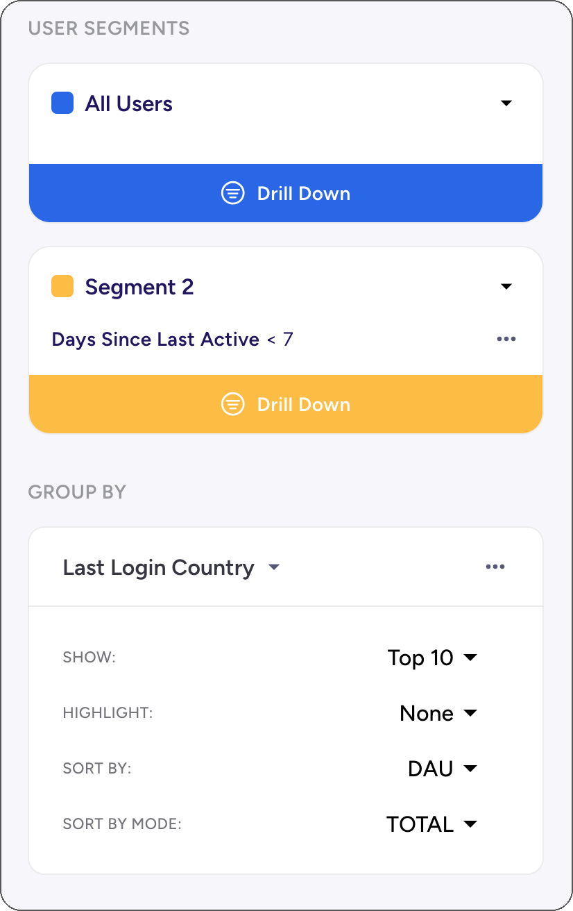

# Creating Dashboards in Asemic

Dashboards in Asemic allow you to combine multiple visualizations into a single view, providing a comprehensive overview of your key metrics and insights. This guide will walk you through the process of creating and customizing dashboards.

## Creating a New Dashboard

### Creating a Dashboard from scratch

One the homepage of your workspace go to Dashboards, if not already there. Here's a dashboard-like option named KPI EXPLORER, this is where you can go for a quick look of a specific metric(s), but also a place where you can start building a dashboard.

{100x100}

1. In the top right corner of KPI EXPLORER click on a the options and then `Clear Dashboard`
2. Click the KPI EXPLORER
3. Add Visualizations and set up Segments
4. Click on the top right button `Save as Dashboard`
5. Give it a name

Now the dashboard is saved as private. You can find it on the home screen in `Dashboard -> All Dashboards`, or in Dashboards -> My Dashboards.

### Editing a Dashboard

In the top bar there's `Edit Mode` switch. As long as it is on, there's an indicatior next to the name of a dashboard signaling that Auto-save is on. Every change will be saved and synced with the cloud.

If you, as a creator, turn off Edit Mode, you can interact with the dashboard as anyone else, no changes will be made.

### Sharing a Dashboard

Once you create a Dashboard, there will be a new option on the right side of top bar - `Share` with closed lock icon. Click on it and you will have two options:
1. __Publish__ - makes it discoverable to everyone in the workspace, it will appear in their All Dashboards space
2. __Copy Link__ - keeps the dashboard private, but anyone who you share the link with can access the dashboard

Clicking on the `Share` you can make previously public dashboard private again.

### Creating a Dashboard from another dashboard

Open a dashboard of interest. Click the arrow next to the name of the dashboard in the top bar and then click `Clone`. Now you can make changes without affecting the original dashboard.

## Adding Visualizations

> TODO: fix this image

There are 3 options currently available:
1. Add Chart
   Under this option you have:
   - Line Chart
   - Bar Chart
2. Add Cohort Chart
3. Table
4. Funnel [WIP]

### 1. Add Chart

Click the `Add Chart` on the top bar (first option). You can select multiple metrics to add, each will be added as a separate chart.

Default view is Line chart, but you can change it in `Full Edit Mode`.

### 2. Add Cohort Chart

Click `Add Cohort Chart` on the top bar. You can select multiple metrics to add, each will be added as a separate chart.

### 2. Add Table

Click `Add Table` on the top bar. You can select multiple metrics to add, they will all be added to the table.

### 3. Add Funnel

> TODO

### Adding Text

1. Click the "Add Text" button to add explanatory text to your dashboard.
2. Use the rich text editor to format your text and add links.

### Arranging Your Dashboard

1. Drag and drop visualizations to rearrange them on your dashboard.
2. Resize visualizations by clicking and dragging the bottom-right corner.

## Applying Global Filters - User Segments

 
#### 1. Drill Down

Click `Drill Down` on any existing segment to add a filter to the segment. This will be applied to all the charts that are using global segments.

> Note: Charts that are not using global settings will have broken link icon displayed in the corner.

#### 2. Add Segment

Click `+Add Segment` to add another segment. By default it will contain All Users.

#### 3. Add Group By

Click `+Add Group by` and pick a dimension from the list. 

By default Top 10 groups will be selected and for each chart its primary metric will be used. You can also set the global sorting criteria using another metric.

For example, Top 10 countries by Retention d1 will often be places where there are just a few active users (pushing Retention to near 100% easily). Instead we might want to take a look at the retention of users in top N markets, which is easily done by setting Sort By to `Revenue`. This way all the charts will show the same 10 countries, which makes it easy to check various metrics at once.

## Dashboards: Asemic Way

Asemic is not a dashboarding tool. Dashboards are just a format for communicating data, but in Asemic the first class citizens are metrics and other elements defined in Semantic Layer. Dashboard is a container within which we can easily recombine these building blocks for various purposes.

1. **Ad-hoc data requests**: Business often needs value of a metric for a specific segment. Just go to KPI explorer, pick a metric or more and define your segment(s). You don't have to save this, it's a minute of work to get it and it is always available.

2. **Exploratory Analysis**: Asemic allows building highly complex analysis out of the box and supports large number of Charts. Put 100s of charts with various segments to give yourself multiple perspectives on data. Once you satisfy your curiosity, build a proper dashboard for sharing with other people.

3. **Operational Dashboard**: There are business units that require a fixed set of metrics with the ability to change the view by tinkering with available filters. In Asemic the line between creating a dashboard and interacting with one is blurred. This enables much greater flexibilty in interacting with a dashboard.

---
Remember, the most effective dashboards are those that provide clear, actionable insights at a glance. Take the time to refine your dashboards and ensure they're meeting the needs of your team.
