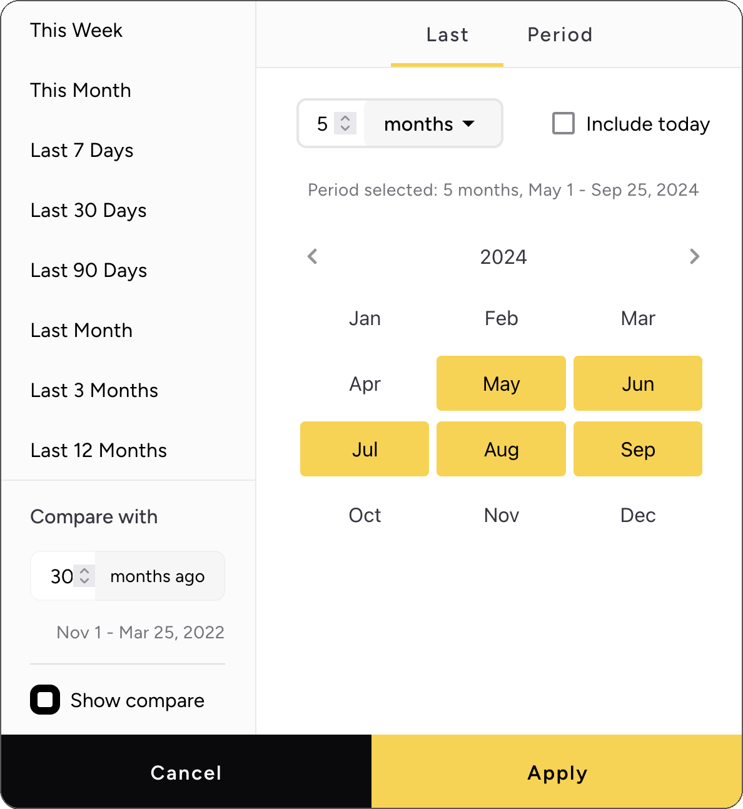

# Setting Dashboard Period

Asemic's custom Date Picker allows you to flexibly set the time period for your dashboard analysis. This guide explains
how to use the Date Picker effectively, including relative and fixed date selections, granularity options, and setting
up comparison periods.

## Date Picker Tabs

The Date Picker has two main tabs:

1. **Last**: For selecting relative time periods
2. **Period**: For selecting fixed date ranges

### Last Tab (Relative Time Periods)

The "Last" tab allows you to select a relative time period. This means your dashboard will always show the most recent
data relative to the current date.

Options include:

- This Week: From the start of the current week until yesterday
- This Month: From the start of the current month until yesterday
- Last 7 days: The 7 days up to yesterday
- Last 30 days: The 30 days up to yesterday
- Last 90 days: The 90 days up to yesterday
- Last Month: The previous complete month
- Last 3 Months: The previous three complete months
- Last 12 Months: The previous twelve complete months

__Example__:
If today is April 22nd:

- "Last Month" will show data from March 1st to March 31st
- "Last 30 days" will show data from March 23rd to April 21st

Use case: Use relative time periods when you want your dashboard to always show the most recent data without manually
updating the date range.

### Period Tab (Fixed Date Ranges)

The "Period" tab allows you to select a specific start and end date for your analysis.

__Example__:
You can set the period from January 1st, 2023 to March 31st, 2023.

Use case: Use fixed date ranges when you want to analyze a specific time period or when you need consistency in reports
across multiple views.

## Granularity Options

For both tabs, you can select the granularity of your data:

- Day
- Week
- Month
- Year

When you select a granularity other than "Day", the Date Picker adjusts to allow selection of whole units of the chosen
granularity.

__Example__:
If you select "Month" granularity:

- The Date Picker will show a month selector
- Your selected period will automatically adjust to include only complete months

Use case: Use different granularities to analyze trends at various time scales or to reduce data noise for longer time
periods.

## Setting Up Comparison Periods

The Date Picker also allows you to set up a comparison period alongside your main selected period. This feature enables
you to calculate and visualize changes in metrics over time.

The comparison period will always match the granularity of your main selected period.

To set up a comparison period:

1. Select your main date range as usual
2. Pick the number of periods you want to

__Example__:
If your main selection is "Last 30 days" with daily granularity, and you choose 7 for comparison:

- Main period: March 23rd to April 21st
- Comparison period: March 16th to April 14th

Use case: Use comparison periods to track performance improvements, identify seasonal trends, or measure the impact of
specific initiatives.

## Best Practices

1. **Granularity Selection**: Choose a granularity that balances detail with readability. Daily data might be too noisy
   for year-long trends, while monthly data might miss important weekly patterns. Match granularity here with the
   granularity in charts - if your charts show months, choose a date range that takes only whole months.

2. **Comparison Periods**: When using comparison periods, consider seasonal effects and ensure you're comparing like
   with like.

3. **Relative vs. Fixed**: Use relative periods for ongoing monitoring and fixed periods for historical analysis or
   event-specific reporting.

---
By leveraging Asemic's flexible Date Picker, you can ensure your dashboards and analyses are always showing the most
relevant data for your needs, whether that's the latest information or a specific historical period.
