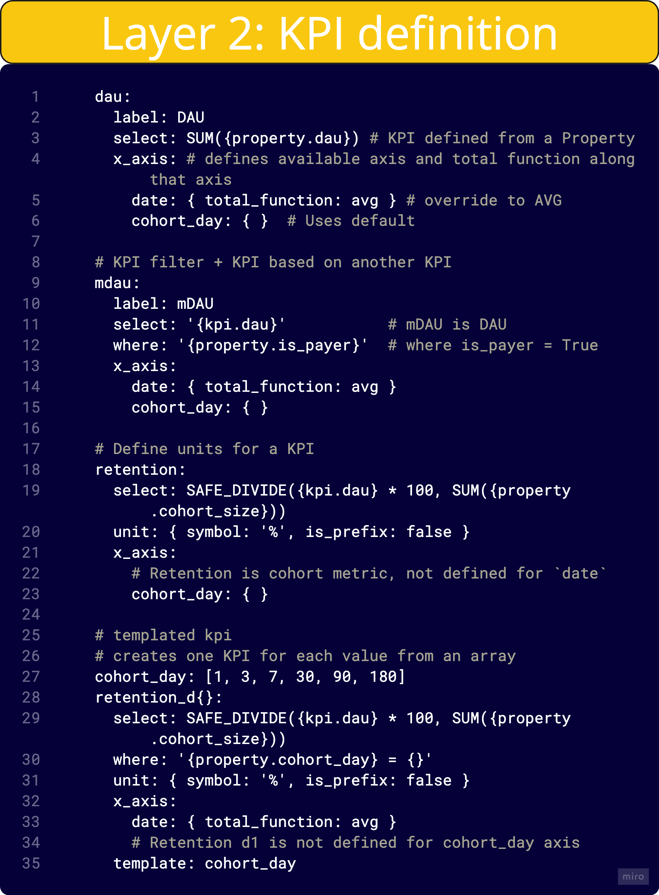

# KPI Layer

The KPI (Key Performance Indicator) Layer is the top tier of Asemic's Semantic Layer. It builds upon the User Properties Layer to create complex, business-relevant metrics that drive your analytics.

## Purpose

The main purposes of the KPI Layer are:

1. To define high-level metrics that align with business objectives
2. To standardize KPI definitions across your organization
3. To enable sophisticated analyses with pre-defined, reusable metrics

## Defining KPIs

KPIs in Asemic are defined using YAML syntax. Here's the basic structure of a KPI definition:

```yaml
kpis:
  kpi_name:
    label: "KPI Display Name"
    select: "SQL-like expression"
    x_axis:
      date: { total_function: avg }
      cohort_day: { }
    unit: { symbol: "$", is_prefix: true }
```



### Key Components

- **kpi_name**: A unique identifier for the KPI
- **label**: The display name for the KPI in the Asemic UI
- **select**: An SQL-like expression that defines how to calculate the KPI
- **x_axis**: Defines how the KPI should be aggregated along different axes
- **unit**: (Optional) Specifies the unit of measurement for the KPI

## Types of KPIs

Asemic supports several types of KPIs:

1. **Simple Aggregations**: Basic summations or averages of user properties
2. **Filtered KPIs**: KPIs that apply specific conditions
3. **Ratio KPIs**: Metrics that divide one value by another
4. **Templated KPIs**: KPIs that generate multiple related metrics

## Examples

### Simple Aggregation KPI

```yaml
kpis:
  dau:
    label: "Daily Active Users"
    select: SUM({property.dau})
    x_axis:
      date: { total_function: avg }
      cohort_day: { }  # TODO: šta ovo znači?
```

### Filtered KPI

```yaml
kpis:
  mdau:
    label: "Monetized Daily Active Users"
    select: '{kpi.dau}'
    where: '{property.is_payer}'
    x_axis:
      date: { total_function: avg }
      cohort_day: { }
```

### Ratio KPI

```yaml
kpis:
  retention:
    label: "Retention"
    select: SAFE_DIVIDE({kpi.dau} * 100, SUM({property.cohort_size}))
    unit: { symbol: "%", is_prefix: false }
    x_axis:
      cohort_day: { }
```

### Templated KPI

```yaml
kpis:
  cohort_day: [1, 3, 7, 30, 90, 180]
  retention_d{}:
    select: SAFE_DIVIDE({kpi.dau} * 100, SUM({property.cohort_size}))
    where: '{property.cohort_day} = {}'
    unit: { symbol: "%", is_prefix: false }
    x_axis:
      date: {}
    template: cohort_day
```

## Best Practices

1. **Use Descriptive Names**: Choose clear, descriptive names for your KPIs that reflect their business meaning.

2. **Document Your KPIs**: Add comments to your YAML files explaining the purpose and calculation method of each KPI.

3. **Standardize Units**: Use consistent units across related KPIs to make comparisons easier.

4. **Consider Performance**: Be mindful of the computational cost of your KPIs, especially for complex calculations.

5. **Use Templated KPIs**: When you need multiple similar KPIs (e.g., retention for different time periods), use templated KPIs to reduce redundancy.

6. **Align with Business Objectives**: Ensure your KPIs directly relate to your key business questions and objectives.

7. **Review and Refine**: Regularly review your KPIs to ensure they're still relevant and accurately measuring what you intend.

## Advanced Features

### KPI Dependencies

KPIs can reference other KPIs, allowing you to build complex metrics from simpler components:

```yaml
kpis:
  arpu:
    label: "Average Revenue Per User"
    select: SAFE_DIVIDE({kpi.total_revenue}, {kpi.dau})
    unit: { symbol: "$", is_prefix: true }
    x_axis:
      date: { total_function: avg }
      cohort_day: { }
```

## Conclusion

The KPI Layer is where your data model comes to life, translating raw data and user properties into meaningful business metrics. By carefully designing your KPIs, you can create a powerful analytics framework that provides actionable insights and drives business decisions.

For more advanced topics, check out our guide on [Custom Metrics and Calculations](../analytics-features/custom-metrics.md).
