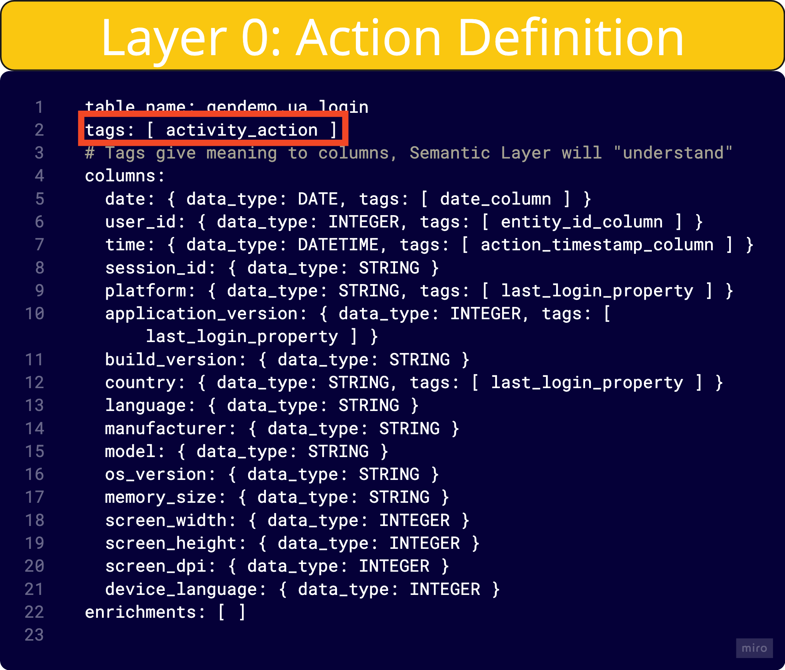

# User Actions Layer

The User Actions Layer is the foundation of Asemic's Semantic Layer. It defines the basic building blocks of user behavior in your product by mapping raw event data to meaningful actions.

## Purpose

The main purposes of the User Actions Layer are:

1. To provide context and meaning to raw event data
2. To standardize the way actions are defined across your organization
3. To enable more intuitive and powerful analytics in higher layers

## Defining User Actions

User Actions are defined using YAML syntax. Here's an example of a User Action definition:

```yaml
table_name: gendemo_ua_login
tags: [ activity_action ]
columns:
  date: { data_type: DATE, tags: [ date_column ] }
  user_id: { data_type: INTEGER, tags: [ entity_id_column ] }
  time: { data_type: DATETIME, tags: [ action_timestamp_column ] }
  session_id: { data_type: STRING }
  platform: { data_type: STRING, tags: [ last_login_property ] }
  application_version: { data_type: INTEGER, tags: [ last_login_property ] }
  country: { data_type: STRING, tags: [ last_login_property ] }
  language: { data_type: STRING }
```

> TODO: we don't need both the image and the definition above


### Key Components

- **table_name**: The name of the table in your data warehouse that contains the event data
- **tags**: Tags that provide additional context about the action
- **columns**: Definitions of the columns in your event table
  - **data_type**: The type of data in the column (e.g., INTEGER, STRING, DATE)
  - **tags**: Tags that provide additional context about the column

#### Tags
> TODO: @korhner list the tags with description

## Best Practices

1. **Use Descriptive Names**: Choose clear, descriptive names for your actions that reflect their purpose in your product.

2. **Be Consistent**: Use consistent naming conventions and tag structures across all your actions.

3. **Include All Relevant Columns**: Even if you're not sure you'll need a column for analysis, include it in the definition. It's easier to ignore unnecessary data than to add missing data later.

4. **Use Tags Effectively**: Tags help Asemic understand the context and purpose of actions and columns. Use them liberally but consistently.

5. **Document Your Actions**: Add comments to your YAML files explaining the purpose and context of each action. This will help other team members understand and use the actions correctly.

## Example: Defining a Purchase Action

Here's an example of how you might define a purchase action:

```yaml
table_name: ecommerce_purchases
tags: [ revenue_action, activity_action ]
columns:
  date: { data_type: DATE, tags: [ date_column ] }
  user_id: { data_type: INTEGER, tags: [ entity_id_column ] }
  time: { data_type: DATETIME, tags: [ action_timestamp_column ] }
  product_id: { data_type: STRING }
  product_name: { data_type: STRING }
  category: { data_type: STRING, tags: [ dimension ] }
  price: { data_type: FLOAT, tags: [ revenue ] }
  quantity: { data_type: INTEGER }
  total_amount: { data_type: FLOAT, tags: [ revenue ] }
  currency: { data_type: STRING }
```

This definition captures all the relevant details of a purchase event, allowing for rich analysis in the higher layers of the Semantic Layer.

## Next Steps

Once you've defined your User Actions, you can use them to create [User Properties](user-properties-layer.md) and [KPIs](kpi-layer.md). These higher layers build on the foundation you've created in the User Actions Layer to enable powerful, flexible analytics.
