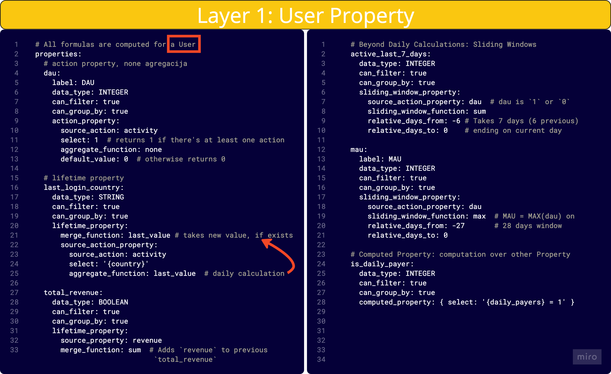

# User Properties Layer

The User Properties Layer is the second tier of Asemic's Semantic Layer. It builds upon the User Actions Layer to create meaningful, aggregated properties for each user on a daily basis.

## Purpose

The main purposes of the User Properties Layer are:

1. To aggregate user actions into meaningful properties
2. To provide a foundation for defining complex KPIs
3. To enable efficient filtering and grouping in analyses

## Types of User Properties

Asemic supports several types of user properties:

1. **Action Properties**: Derived directly from user actions
2. **Lifetime Properties**: Cumulative properties that track user behavior over their entire history
3. **Sliding Window Properties**: Properties calculated over a specific time window
4. **Computed Properties**: Properties derived from other properties using custom formulas



## Defining User Properties

User Properties are defined using YAML syntax. Here's an example of different types of property definitions:

```yaml
properties:
  # Action Property
  dau:
    label: DAU
    data_type: INTEGER
    can_filter: true
    can_group_by: true
    action_property:
      source_action: activity
      select: 1
      aggregate_function: none
      default_value: 0

  # Lifetime Property
  last_login_country:
    data_type: STRING
    can_filter: true
    can_group_by: true
    lifetime_property:
      merge_function: last_value
      source_action_property:
        source_action: activity
        select: '{country}'
        aggregate_function: last_value

  # Sliding Window Property
  active_last_7_days:
    data_type: INTEGER
    can_filter: true
    can_group_by: true
    sliding_window_property:
      source_property: dau
      sliding_window_function: sum
      relative_days_from: -6
      relative_days_to: 0

  # Computed Property
  is_daily_payer:
    data_type: INTEGER
    can_filter: true
    can_group_by: true
    computed_property: 
      select: '{daily_payers} = 1'
```

## Best Practices

1. **Start Simple**: Begin with basic properties and build complexity as needed.

2. **Use Descriptive Names**: Choose clear, descriptive names for your properties that reflect their purpose.

3. **Consider Performance**: Be mindful of the computational cost of your properties, especially for sliding window and computed properties.

4. **Document Your Properties**: Add comments to your YAML files explaining the purpose and calculation method of each property.

5. **Reuse Properties**: When defining complex properties, try to build upon simpler, existing properties where possible.

6. **Use Appropriate Data Types**: Choose the correct data type for each property to ensure accurate calculations and efficient storage.

## Example: Defining a Revenue Property

Here's an example of how you might define a revenue property:

```yaml
properties:
  daily_revenue:
    label: Daily Revenue
    data_type: FLOAT
    can_filter: true
    can_group_by: true
    action_property:
      source_action: purchase
      select: '{amount}'
      aggregate_function: sum
      default_value: 0

  lifetime_revenue:
    label: Lifetime Revenue
    data_type: FLOAT
    can_filter: true
    can_group_by: true
    lifetime_property:
      source_property: daily_revenue
      merge_function: sum

  revenue_last_30_days:
    label: Revenue Last 30 Days
    data_type: FLOAT
    can_filter: true
    can_group_by: true
    sliding_window_property:
      source_property: daily_revenue
      sliding_window_function: sum
      relative_days_from: -29
      relative_days_to: 0
```

This set of properties allows you to analyze revenue on a daily basis, track lifetime value, and look at recent purchasing behavior.

## Next Steps

Once you've defined your User Properties, you can use them to create [KPIs](kpi-layer.md) and perform complex analyses. The User Properties Layer provides the building blocks for sophisticated analytics while abstracting away the complexity of raw event data.
