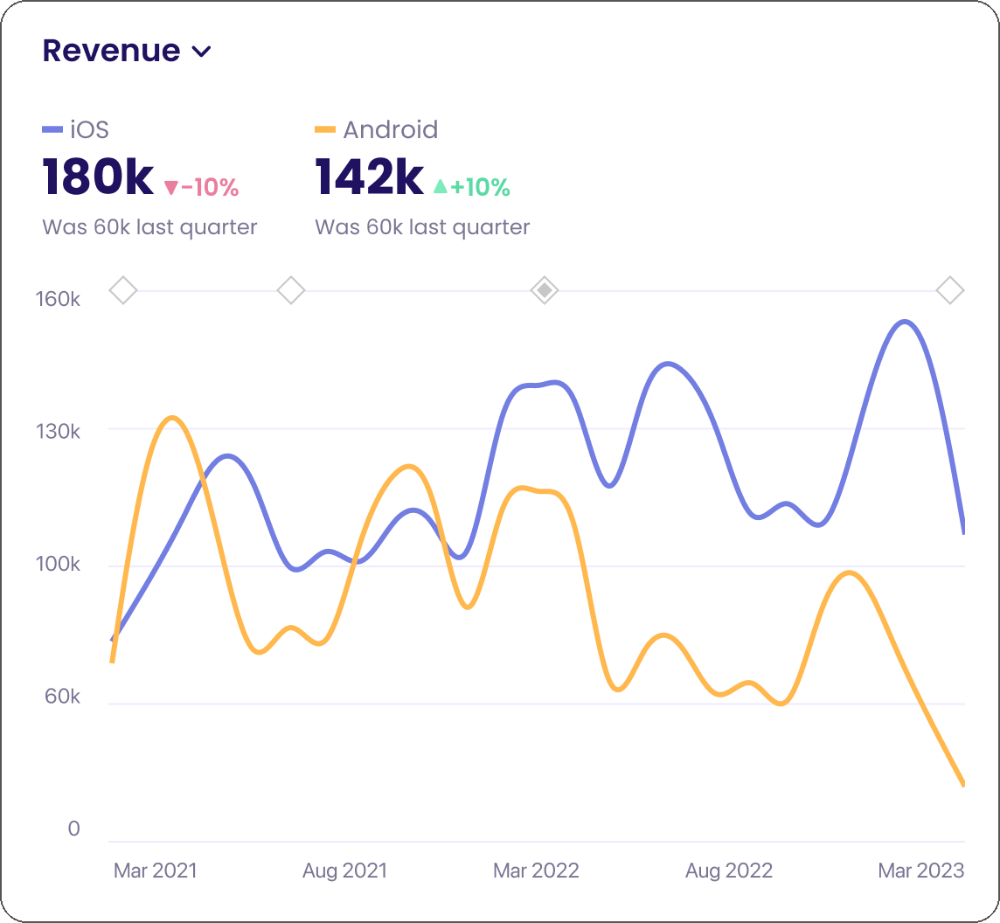
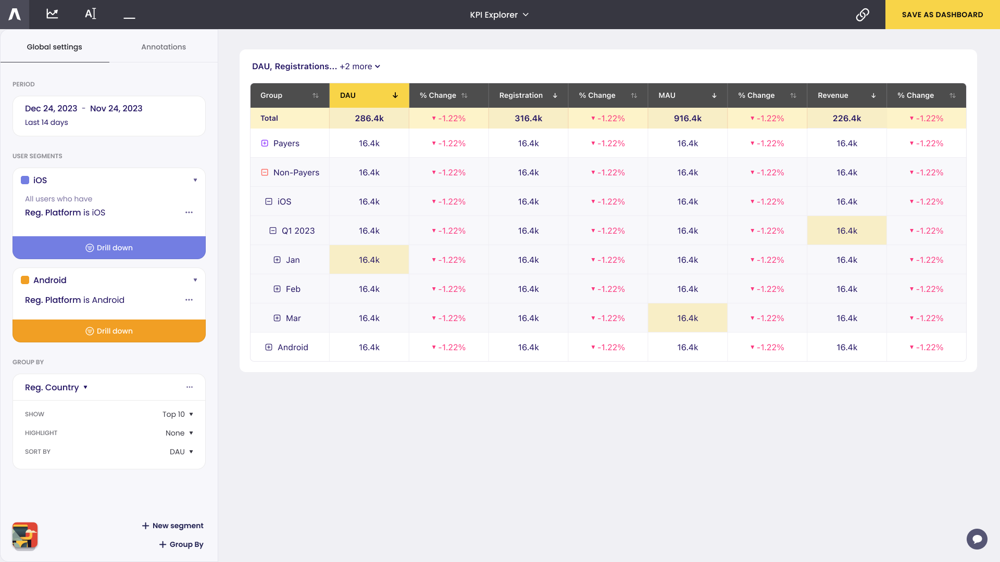

# Chart Types in Asemic

Asemic offers a variety of chart types to help you visualize your data effectively. This guide will introduce you to the available chart types and provide guidance on when to use each one.

## Line Chart

Line charts are ideal for showing trends over time or comparing multiple metrics.

**Use cases:**
- Tracking KPIs over time
- Comparing performance across different segments

To create a line chart:
1. Select your KPI
2. Choose 'Date' as your X-axis
3. (Optional) Add segments or groups

## Bar Chart

Bar charts are great for comparing values across categories.

**Use cases:**
- Comparing revenue across product categories
- Visualizing user distribution by country

To create a bar chart:
1. Select your KPI
2. Choose a categorical dimension for your X-axis
3. (Optional) Add segments or groups

## Cohort Chart

Cohort charts help you analyze how user behavior changes over time for different cohorts.

**Use cases:**
- Analyzing retention rates
- Comparing LTV for different acquisition cohorts

To create a cohort chart:
1. Select your KPI
2. Choose 'Cohort Day' as your X-axis
3. Define your cohort (e.g., by registration date)

## Funnel Chart

Funnel charts visualize user progression through a series of steps.

**Use cases:**
- Analyzing conversion rates through a purchase flow
- Identifying drop-off points in user onboarding

To create a funnel chart:
1. Go to the Funnel Analysis section
2. Define your funnel steps
3. (Optional) Add segments for comparison

## Table

Tables provide a detailed view of your data, allowing for precise comparisons and drill-downs.

**Use cases:**
- Detailed breakdowns of KPIs by multiple dimensions
- Exporting data for further analysis

To create a table:
1. Select your KPIs
2. Choose your dimensions for rows and columns
3. (Optional) Add filters and sorting

## Asemic's Layout Engine

Asemic's Layout Engine automatically selects the most appropriate chart type based on your data and analysis context. However, you can always override this selection and choose a different chart type if desired.

To change the chart type:
1. Click on the chart type icon in the top-right corner of your visualization
2. Select your preferred chart type from the dropdown menu

Remember, the best chart type depends on the story you're trying to tell with your data. Experiment with different visualizations to find the one that communicates your insights most effectively.

For more advanced visualization techniques, check out our guide on [Creating Custom Visualizations](custom-visualizations.md).
