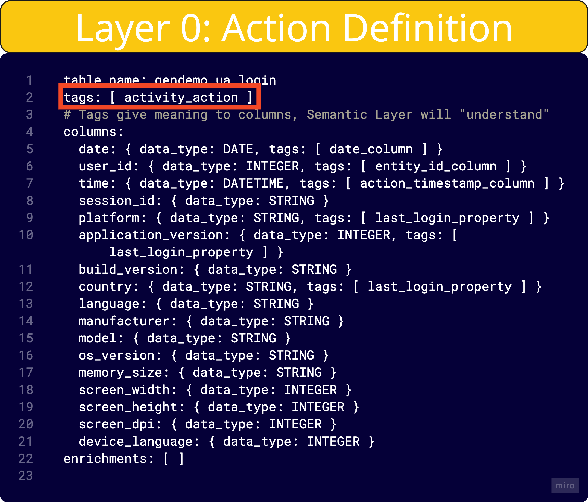
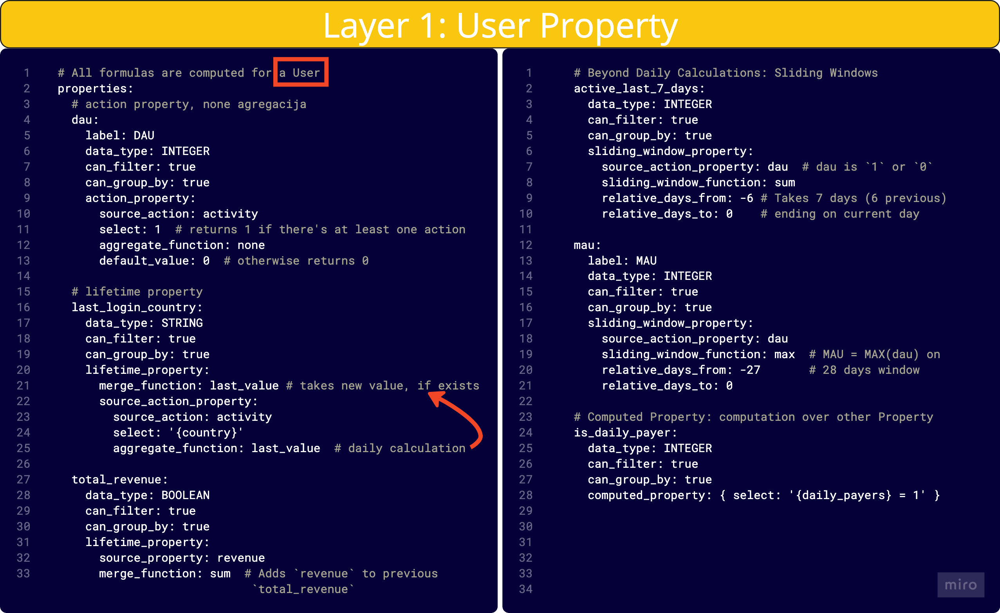
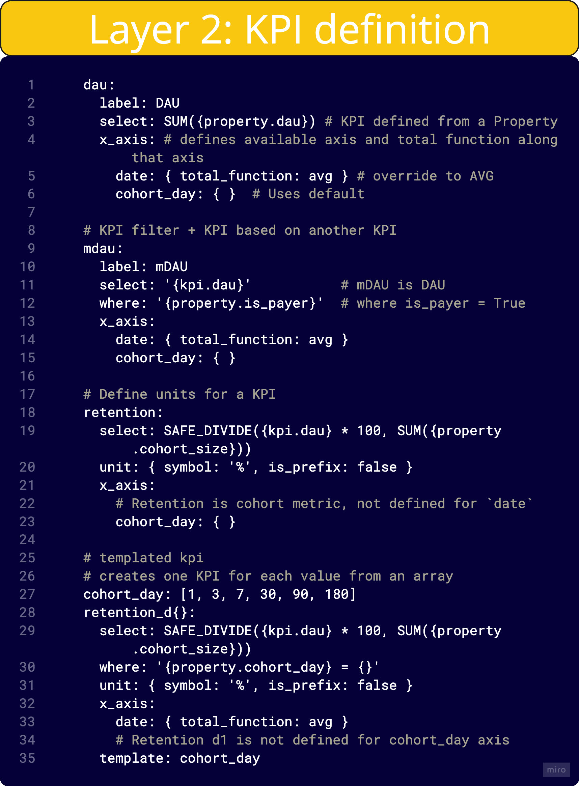
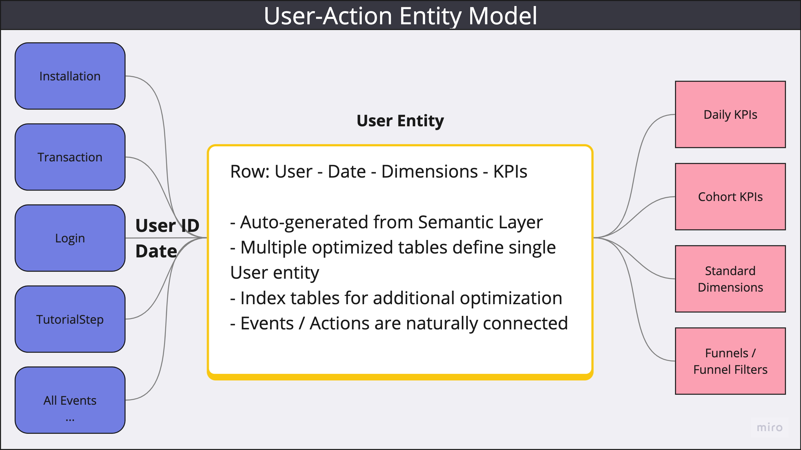

# Semantic Layer: The Foundation of Advanced Product Analytics

## A New Paradigm in Product Analytics Modeling

Our Semantic Layer has been completely reimagined to align with our vision of delivering powerful, flexible product analytics. Asemic’s hybrid approach blends User Events with a data warehouse modeling structure to create a User-Action Entity Model, focused around the concept of the User. This ensures you have a clear, organized, and scalable framework for extracting the insights that matter most.

## Why a Hybrid Approach?

Traditional models fall short when dealing with complex, behavior-driven data. Here’s how our hybrid solution addresses their limitations:

- __Event-Only Models__: As event volume grows, processing becomes cumbersome and unmanageable.
- __Star Schema Models__: They’re constrained by predefined concepts, limiting flexibility when new business questions arise.

Our hybrid Semantic Layer is tailor-made for Product Analytics, streamlining:

- Data model generation and maintenance
- KPI and dimension definition
- Handling ad-hoc analysis requests

## Semantic Layer Structure

Our Semantic Layer consists of three distinct layers, each designed to simplify the complexities of behavior-driven data:

1. __User Actions Layer__: Defines available User Actions. These actions can be events or event-like tables. For example, a Session action can be generated with a beginning and an end, calculated from other tracked events, or using the output of an ML model.

2. __User Properties Layer__: Aggregates actions on a per User per day basis. These properties serve as the building blocks for defining KPIs.

3. __KPI Layer__: Constructs KPIs with awareness of axes and supports different functions for calculating rollups or totals along various dimensions.

## Auto-Generation and Maintenance

Asemic automatically generates and maintains your data model using the definitions in the User Properties Layer and semantic tags in the User Actions Layer. The resulting User Entity model behaves like a wide table, containing data for each user on each day—but it’s not physically stored in this format. Our proprietary Query Engine (QE) dynamically selects the optimal tables, ensuring peak performance.

When new properties are defined, they are materialized lazily, starting from the next day. If historical data is available, it can still be accessed and queried seamlessly. The Query Engine can construct fields on-the-fly based on their definitions, even for semi-materialized properties. However, certain calculations, like lifetime metrics, must be fully materialized in advance due to their complexity.

## Seamless Integration with Your Data Warehouse

Integrating Asemic is straightforward, requiring just a few prerequisites:

1. A SQL data warehouse containing user events, whether stored in multiple tables or one consolidated table.
2. A table or event that captures the first appearance of each user.
3. A table or event that tracks user activity.

If these conditions are met, connecting Asemic and setting up the Semantic Layer takes less than a day. Once integrated, you can immediately begin harnessing the power of our advanced analytics platform.