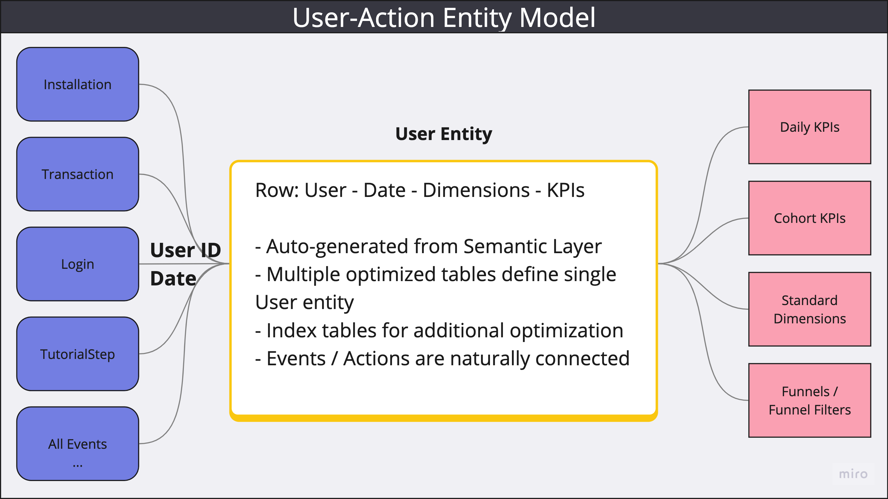
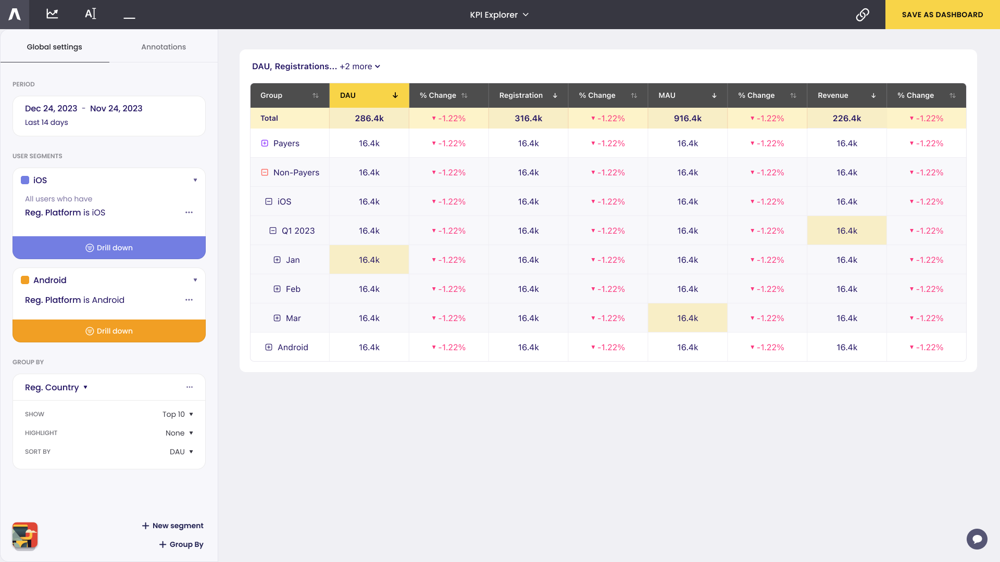
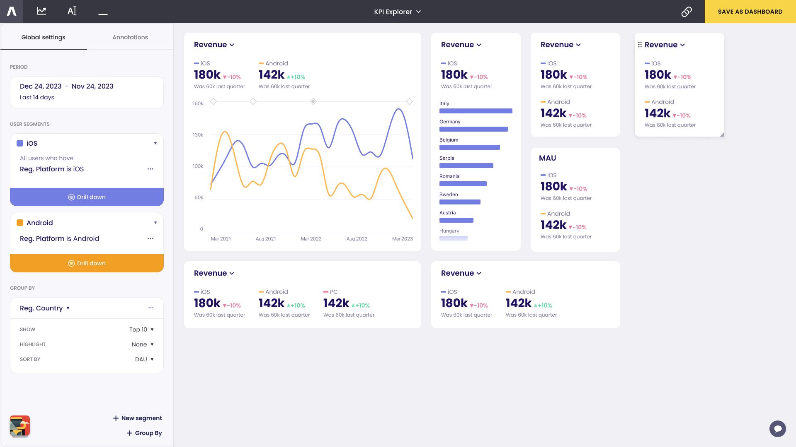
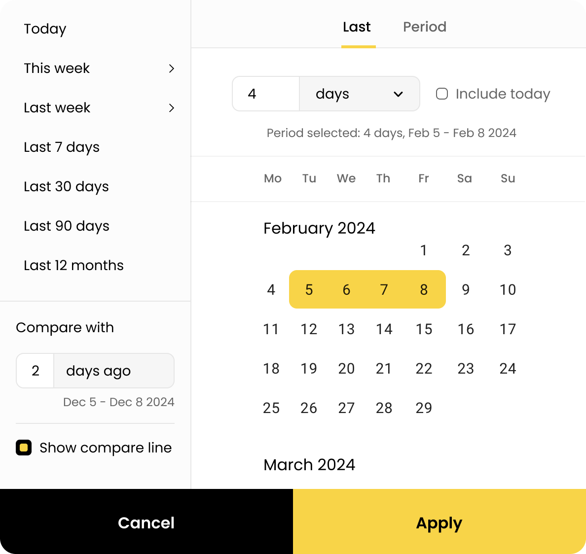
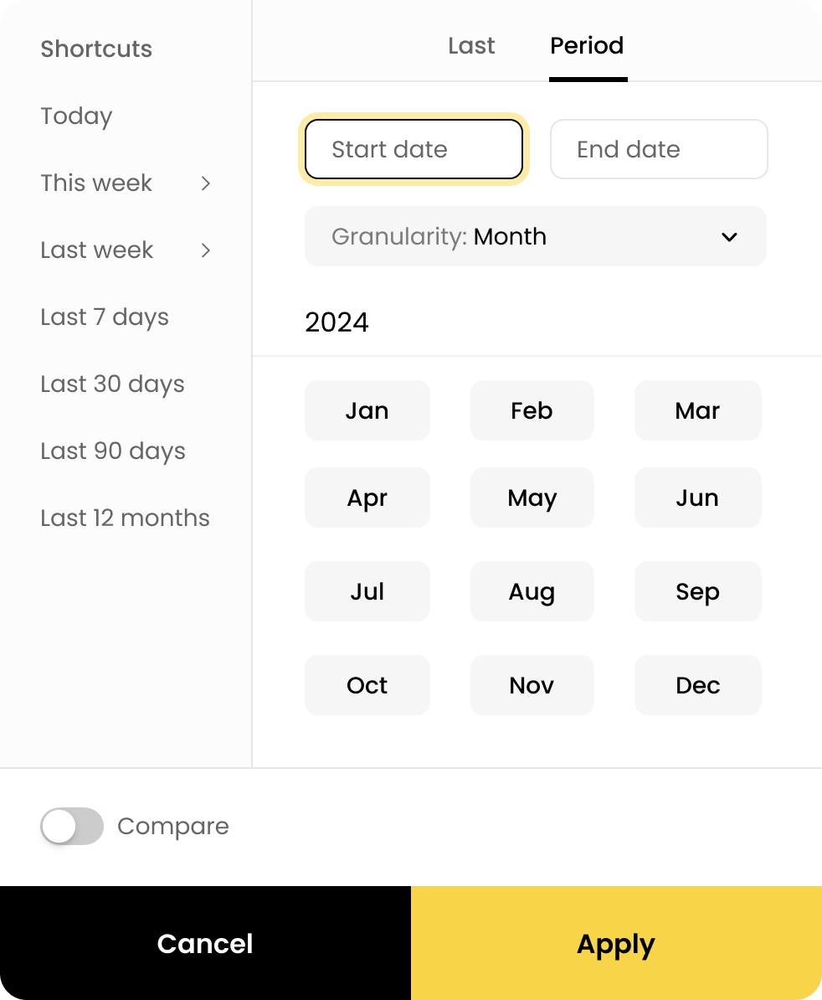

# What's New?

## July 2024

Welcome to our inaugural update! We have a lot of exciting new features and improvements to share with you.

#### Semantic Layer

We have completely reworked the Semantic Layer to align with our vision. Our hybrid approach combines User Events with a
data warehouse modeling structure, resulting in a User-Action Entity Model centered around the concept of a User.

##### Why a Hybrid Approach?

This hybrid approach addresses the limitations of using either modeling technique exclusively:

- Event-Only Models: Processing data becomes increasingly unmanageable as the volume of events grows.
- Star Schema Models: Limited to predefined concepts, reducing flexibility.

Our Semantic Layer is tailored for Product Analytics, simplifying:

- Data model generation and maintenance
- KPI and dimension definition and management
- Ad-hoc request handling

##### Semantic Layer(s) Breakdown

The Semantic Layer comprises three distinct layers:

1. __User Actions Layer__: Defines available User Actions. These actions can be events or event-like tables. For
   example, a Session action can be generated with a beginning and an end, calculated from other tracked events, or
   using the output of an ML model.


2. __User Properties Layer__: Aggregates actions on a per User per day basis. These properties serve as the building
   blocks for defining KPIs.


3. __KPI Layer__: Constructs KPIs with awareness of axes and supports different functions for calculating rollups or
   totals along various dimensions.


##### Auto-Generation and Maintenance

With property definitions from Layer 1 and appropriate semantic tags in Layer 0, our system, Asemic, automatically
generates the data model. The User Entity model acts like a wide table with data for each user for each day, but is not
physically stored in that format. Our proprietary Query Engine (QE) optimizes table selection.

When a new property is defined, it is materialized lazily, starting from the next day. If historical data is available,
it can still be utilized. The Query Engine can construct these fields on the fly in the query, using their definitions
from SL, even supporting seamless querying of semi-materialized properties. Note that lifetime calculation __must__ be
materialized prior to usage, as it's near impossible to construct these fields on the fly.



##### Integration

There are a few loose prerequisits for integrating Asemic:

1. SQL data warehouse with user events, either stored in separate tables, or in one big table
2. One of the events / user action tables should have one row per the first appereance of a User
3. One of the events / user action tables should encode the information about User's activity

If these conditions are met, it takes less than a day to connect Asemic and set up Semantic Layer. After that you can
start using the application immidiatelly.

##### Composability

SQL is the assembler of databases. It's also the python of databases, in a sense that it's easy to learn (but hard to
master) and is ubiquitous. Unfortunatelly, it is also too low-level for many business users. There's a limited number of
business questions that can be answered with `SELECT FROM table GROUP BY dimension`.

What we have created is a SQL-like language that compiles to SQL. We have it on our roadmap to actually expose headless
Semantic Layer and enable users to query it in the form of:

```sql
select
	`date`,
	`kpi.retention`
from `user_entity`
group by `country`
order by `kpi.revenue`
limit 10 by `country`
```

This would be "compiled" to regular SQL (100s of lines, even thousands) and executed in your database against your data.
Or

```sql
select `kpi.dau`
from `user_entity` 
where `user_id` in (select `user_id` from sequence('login >> transaction'))
```

But more on this in our Roadmap

Why is this important? SQL is familiar interface for both people and machines, but Asemic SL allows writing a query on
the higher level of abstraction than "vannila" SQL, much closer to the domain of business questions. It's aware of
date/time, typical axis, concept of dimension and, in general, aware of the data model, unlike plain SQL that treats
data as flat tables. Same building block, eg. a Property, can be used in different places inside a query and will
happily take different function without fidgeting with it manually. So, a block that calculates KPI change can return
this value as data, or be used to select top N countries with highest change in some KPI.

#### BI tool

###### Visualizations

Done:

- Line Chart
- Cohort Chart
- Bar Chart
- Table
    - Free-form drill-down - set a hiararchy of multiple dimensions and drill-down directly on the table
- Two types of Color Legend:
    - Basic Color Legend - name and color
    - Color Legend with Highlights - Big numbers showing last value or total
- Easy comparison line



Table, with freeform drill-down by dimension hierarchy

###### Segments

Done:

- Segments
    - Color / name customization
- Drill-down
    - By predefined dimension
- Performed event filter
    - Performed event in a specific period
    - Performed event in a relative sliding window period
- Group by
    - Group by predefined dimensions
    - Color customization for group by segments
    - Drill-Down group segment (adds this value as a filter to all segments and removes group by)
    - Highlight - grays out all the other group by segments
    - Global Sort + Top/Bottom N -

<video height="400px" controls="false" autoplay="autoplay" loop muted>
  <source src="assets/ImpactOnChange.mov">
</video> 

Drill down by country and sort by the impact each country had on overall KPI change.

 
Overview of a dashboard


<video height="400px" controls="false" autoplay="autoplay" loop muted>
  <source src="assets/PerformedEvent.mov">
</video> 

Performed Event filter.

###### Date Picker

Flexible Date Picker allows:

- Choosing a fixed period or sliding window period
- Picking derivates of the Date dimension: (a whole) week, month, year

 


### Roadmap

#### Sequence Query Language

We've defined domain language for working with sequences of events. This is something that SQL can do well, but it's
extremely tedious to actually write such a query, especially if we want to make it optimal (cheap and fast). It's also
an error prone process that takes too much of analysts valuable time. We've devised a set of operations that can be
combined to construct basic Funnels and User Journeys, but also some more advanced concepts of Funnels and additionally,
it can be used outside the app to prepare a new dataset for in depth analysis.

In it's simplest form, you can simply write:

```python
match Login >> UseCoupon >> Purchase
```

Only these three events will be used. You can add more

Complete list of operations:

- __domain add__: expands the domain beyond what's referenced in `match` section. Influences the result.
- __split__: "cut" the sequence into subsequences that will be further processed
- __match__: RegEx-like pattern will be applied to subsequence§s and events will be appropriatelly labeled
- __set__: exposes some variables
- __filter__: removes individual events, steps, or subsequences
- __merge__: will remove the last split

```
Status:
	Design: Done
	QE    : 80% Done
	BI    : 10% Done
```

#### Layout Engine

Layout Engine is a rules based engine that takes into account:

- KPI(s)
- Data Points
- Number of Segments
- Size of a visualization widgets
- Time Grain
- etc

And produces visualization that's optimal for a given context.
Customization is two layered:

- via quick actions on the widget (common preset actions)
- via Full Edit Mode screen (detailed options, can override Layout Engine completely)

```
Status:
	Design: Done
	QE    : none
	BI    : 20% Done
```

#### Semantic Layer improvements

- Support for multiple datasources
    - Support for simple datasources (connect to a table / view)
- Bunch of performance optimizations
- Aggregated tables in User Entity (serve KPIs at specific grains super-fast)
- Sampled datasource (sample x% of users from all tables in a datasource into their mirror-copy; can be used to explore
  data 20-30x cheaper, before moving to the full dataset)
- Cache Layer

#### BI improvements

###### Segmentation

- Drill-down by dimension value in a specific period
- Drill-down by dimension value in a relative sliding window period
- Filter by sequence of events a user has performed
    - also Filter by sequence of events a user has performed in a specific period
    - also Filter by sequence of events a user has performed in a relative sliding window period

###### Visualization

- Dual axis - scatter plot visualization
- KPI targets (set target value / function for KPI, get comparisons against that)
-

###### Other

- email reports

------

Stay tuned for more updates as we continue to enhance our platform!

